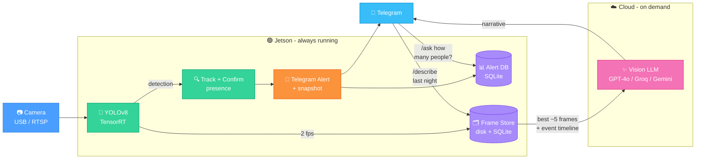

# Jetson YOLO Alert + Video Understanding

Real-time object detection on NVIDIA Jetson with Telegram alerts and on-demand video understanding via cloud Vision-Language Models.

## What It Does

- **Detects objects** (people, animals, vehicles) using YOLOv8 + TensorRT on Jetson
- **Sends Telegram alerts** with annotated snapshots when trigger classes appear
- **Captures frames** during detections at 2 fps, indexed for fast retrieval
- **Describes what happened** on demand -- ask about any past time period and get a narrative from a cloud VLM
- **Answers alert history questions** via `/ask` (Text-to-SQL over the alert database)

## Quick Start

```bash
# 1. Copy and edit config
cp .env.example .env
# Edit .env: set SRC, TELEGRAM_TOKEN, TELEGRAM_CHAT_ID, API keys

# 2. Build
docker compose build

# 3. Export TensorRT engine (once per device)
docker compose run --rm exporter

# 4. Run
docker compose up -d alert ask-telegram
```

## Telegram Commands

- `/describe last night` -- VLM describes what the camera saw
- `/describe last 30 minutes` -- recent activity
- `/describe yesterday afternoon` -- any natural language time reference
- Send a video file -- bot analyzes and describes the video
- `/ask how many people today?` -- SQL-based alert history query
- `/ask any dogs this week?` -- works for any alert-history question

## How It Works



## Configuration

All config is in `.env`. The essentials: `SRC` (camera), `YOLO_ENGINE`, `TRIGGER_CLASSES`, `TELEGRAM_TOKEN`, `TELEGRAM_CHAT_ID`, `LLM_MODEL` (for `/ask`), `VLM_MODEL` (for `/describe`).

Full reference: [docs/configuration.md](docs/configuration.md)

## Docs

- [docs/configuration.md](docs/configuration.md) -- all environment variables
- [docs/services.md](docs/services.md) -- Docker Compose services, setup, preview, telemetry
- [docs/DESIGN.md](docs/DESIGN.md) -- architecture and design decisions
- [docs/metrics.md](docs/metrics.md) -- telemetry metrics and Grafana
- [docs/AGENTS.md](docs/AGENTS.md) -- QA trace debugging

## License

MIT
