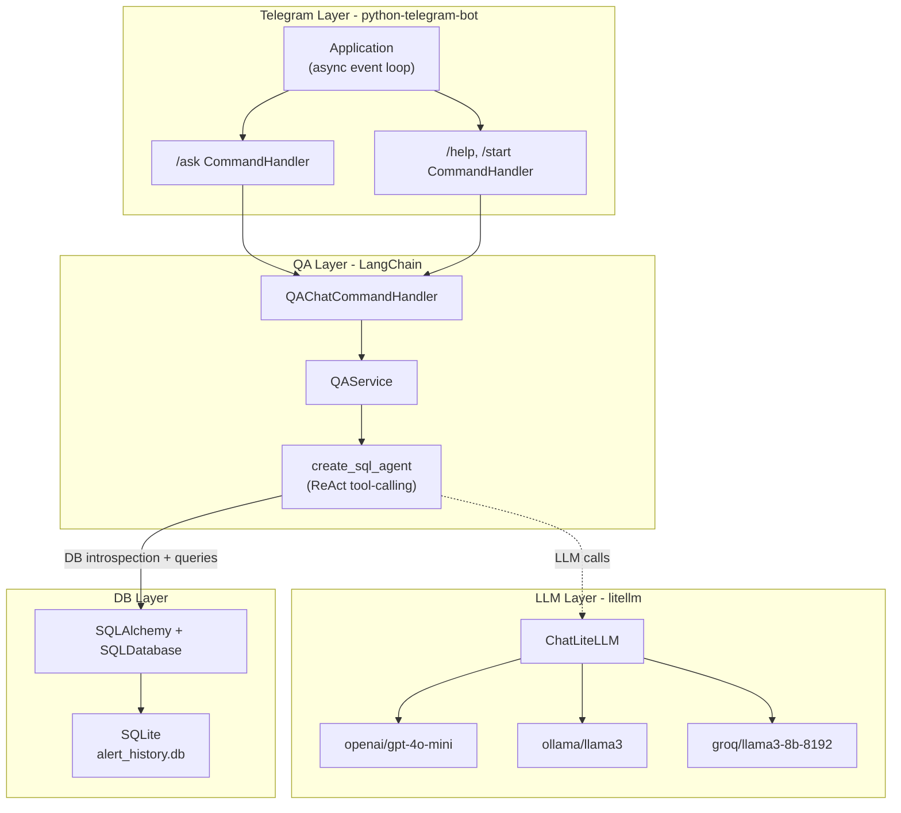

# Full Industry Refactor

Three hand-rolled subsystems get replaced with production-grade libraries:


| Component    | Current (hand-rolled)                      | New (industry standard)                              |
| ------------ | ------------------------------------------ | ---------------------------------------------------- |
| LLM client   | `requests.post` to OpenAI                  | **litellm** (100+ providers)                         |
| Text-to-SQL  | manual prompt + regex extraction + 1 retry | **LangChain `create_sql_agent`** (ReAct + 3 retries) |
| Telegram bot | raw `getUpdates` polling loop              | **python-telegram-bot** (async Application)          |


## Architecture




---

## 1. Dependencies (`requirements.txt`)

Add to `requirements.txt`:

```
litellm>=1.40
langchain>=0.2
langchain-community>=0.2
langchain-openai>=0.1
langgraph>=0.1
sqlalchemy>=2.0
python-telegram-bot>=21.0
```

---

## 2. LLM adapter: litellm replaces raw requests

**Delete** `app/adapters/llm_openai.py` (41 lines of hand-rolled HTTP).

**Create** `app/adapters/llm_litellm.py` -- thin wrapper:

```python
from langchain_community.chat_models import ChatLiteLLM

def build_chat_llm(model: str, temperature: float = 0) -> ChatLiteLLM:
    return ChatLiteLLM(model=model, temperature=temperature)
```

litellm reads API keys from standard env vars (`OPENAI_API_KEY`, `GROQ_API_KEY`, etc.) -- no manual header wiring.

---

## 3. Text-to-SQL: LangChain SQL agent replaces manual prompts

**Rewrite** `app/core/qa.py` -- currently 199 lines of manual prompt engineering, regex SQL extraction, single-retry error handling. Replace with ~50 lines:

```python
from langchain_community.utilities import SQLDatabase
from langchain_community.agent_toolkits import create_sql_agent

SYSTEM_PREFIX = """You answer questions about an object-detection alert database.
All timestamps in the DB are UTC. The user is in India (IST = UTC+5:30).
Always convert and display times in IST. Current time: {now_ist}."""

@dataclass
class QAService:
    db: SQLDatabase
    llm: ChatLiteLLM

    def answer_question(self, question: str) -> str:
        agent = create_sql_agent(
            self.llm, db=self.db,
            agent_type="tool-calling",
            prefix=SYSTEM_PREFIX.format(now_ist=...),
        )
        result = agent.invoke({"input": question})
        return result["output"]
```

The agent automatically: lists tables, reads schema, generates SQL, validates it, executes read-only, self-corrects up to 3 times, and formats the answer.

---

## 4. Telegram bot: python-telegram-bot replaces raw polling

**Delete** `app/adapters/chat_telegram_polling.py` (73 lines of manual `getUpdates` loop).

**Create** `app/adapters/chat_telegram_bot.py` -- async `python-telegram-bot`:

```python
from telegram import Update
from telegram.ext import (
    ApplicationBuilder, CommandHandler, MessageHandler,
    ContextTypes, filters,
)

def build_telegram_app(token, qa_service, allowed_chat_id=None):
    async def ask_handler(update: Update, context: ContextTypes.DEFAULT_TYPE):
        question = " ".join(context.args) if context.args else ""
        if not question:
            await update.message.reply_text("Add a question after /ask.")
            return
        answer = qa_service.answer_question(question)
        await update.message.reply_text(answer)

    async def help_handler(update: Update, context: ContextTypes.DEFAULT_TYPE):
        await update.message.reply_text("Use /ask <question> to query alert history.")

    app = ApplicationBuilder().token(token).build()
    app.add_handler(CommandHandler("ask", ask_handler))
    app.add_handler(CommandHandler(["help", "start"], help_handler))
    return app
```

Key improvements over current code:

- **Async** -- non-blocking I/O, no `time.sleep()` loops
- **Declarative routing** -- `CommandHandler("ask", ...)` instead of manual string parsing
- **Built-in** error handling, rate limiting, connection pooling, graceful shutdown
- **No manual offset tracking** -- the library handles `getUpdates` offsets internally
- Chat ID filtering via `filters.Chat(chat_id=...)` if `TG_QA_ALLOWED_CHAT_ID` is set

---

## 5. Entrypoint: `app/app/ask_telegram.py`

**Rewrite** `app/app/ask_telegram.py` to use the new adapter:

```python
def main():
    cfg = Config()
    qa_service = build_qa_service(cfg)
    app = build_telegram_app(cfg.tg_token, qa_service, cfg.tg_qa_allowed_chat_id)
    app.run_polling()
```

No more manual `while True` loop, no `PermissionError` try/except for DB path (handled in factory).

---

## 6. Factory: `app/core/qa_factory.py`

**Rewrite** `app/core/qa_factory.py` to wire LangChain components:

```python
from langchain_community.utilities import SQLDatabase
from ..adapters.llm_litellm import build_chat_llm

def build_qa_service(cfg: Config) -> QAService:
    db = SQLDatabase.from_uri(f"sqlite:///{cfg.alert_db_path}")
    llm = build_chat_llm(model=cfg.llm_model)
    return QAService(db=db, llm=llm)
```

---

## 7. Config simplification (`app/core/config.py`)

Remove from `app/core/config.py`:

- `llm_provider` -- litellm infers provider from model string prefix
- `openai_base_url` -- litellm reads from env or uses defaults
- `tg_qa_poll_timeout_sec` -- python-telegram-bot manages polling internally
- `tg_qa_idle_sleep_sec` -- no manual sleep loop anymore

Keep:

- `llm_model` -- now accepts litellm format: `openai/gpt-4o-mini`, `ollama/llama3`, `groq/llama3-8b-8192`
- `tg_qa_allowed_chat_id` -- still needed for access control

---

## 8. `.env.example` update

Before (7 LLM/TG-QA variables):

```
LLM_PROVIDER=none
LLM_MODEL=gpt-4o-mini
OPENAI_API_KEY=
OPENAI_BASE_URL=https://api.openai.com/v1
TG_QA_ALLOWED_CHAT_ID=
TG_QA_POLL_TIMEOUT_SEC=25
TG_QA_IDLE_SLEEP_SEC=1
```

After (3 variables):

```
LLM_MODEL=openai/gpt-4o-mini    # or ollama/llama3, groq/llama3-8b-8192
OPENAI_API_KEY=                   # only needed for OpenAI provider
TG_QA_ALLOWED_CHAT_ID=           # optional: restrict which chat can use /ask
```

---

## 9. `chat_commands.py` -- minor update

`app/core/chat_commands.py` stays mostly the same. The `handle_text()` method is still used by the Telegram adapter, but the adapter now calls it for `MessageHandler` (non-command text). The `/ask` command is now handled directly by `CommandHandler` in the Telegram layer, so `chat_commands.py` becomes a fallback for plain text messages only. Can be simplified or kept as-is for CLI compatibility.

---

## 10. Tests (`tests/test_qa.py`)

**Rewrite** `tests/test_qa.py` for the new agent-based service:

- Mock `create_sql_agent` to return canned answers
- Test `QAService.answer_question()` end-to-end with a real SQLite DB
- Test error handling (no LLM configured, empty question)
- Keep SQL extraction/safety tests if any standalone helper functions remain

---

## 11. README migration guide

Add a "Migration from v1" section to `README.md` covering:

- **What changed**: hand-rolled code replaced with litellm + LangChain + python-telegram-bot
- `.env` migration: old variables to remove, new format for `LLM_MODEL`
- **Supported providers**: table with model string examples (OpenAI, Ollama, Groq)
- **Removed variables**: `LLM_PROVIDER`, `OPENAI_BASE_URL`, `TG_QA_POLL_TIMEOUT_SEC`, `TG_QA_IDLE_SLEEP_SEC`
- Update the environment variables table to remove deprecated rows
- Update features list to mention LangChain SQL agent and multi-provider LLM support

---

## Files changed summary

- **Delete**: `app/adapters/llm_openai.py`, `app/adapters/chat_telegram_polling.py`
- **Create**: `app/adapters/llm_litellm.py`, `app/adapters/chat_telegram_bot.py`
- **Rewrite**: `app/core/qa.py`, `app/core/qa_factory.py`, `app/app/ask_telegram.py`, `tests/test_qa.py`
- **Update**: `app/core/config.py`, `app/core/chat_commands.py`, `.env.example`, `requirements.txt`, `README.md`
- **Unchanged**: `app/core/alert_history.py`, `app/core/pipeline.py`, `app/tools/ask.py`, `docker-compose.yml`, all detection/tracking code
